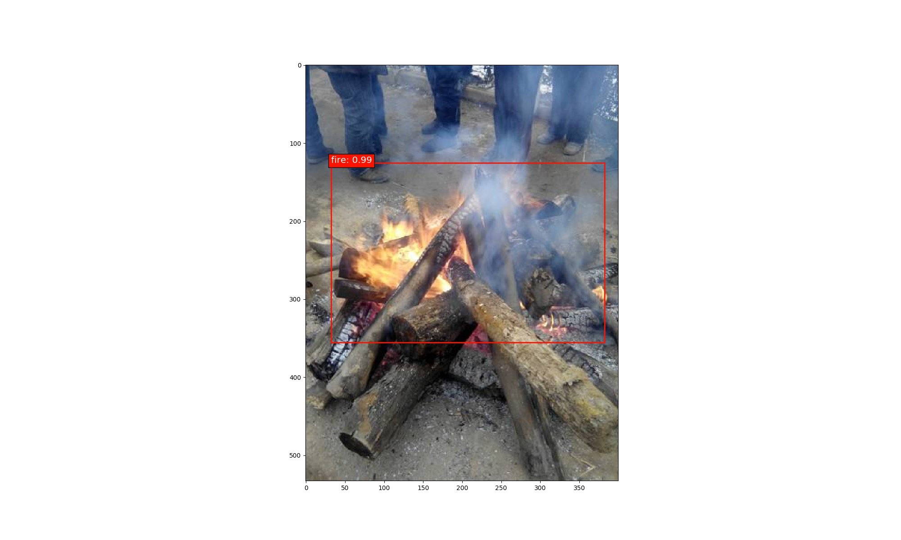
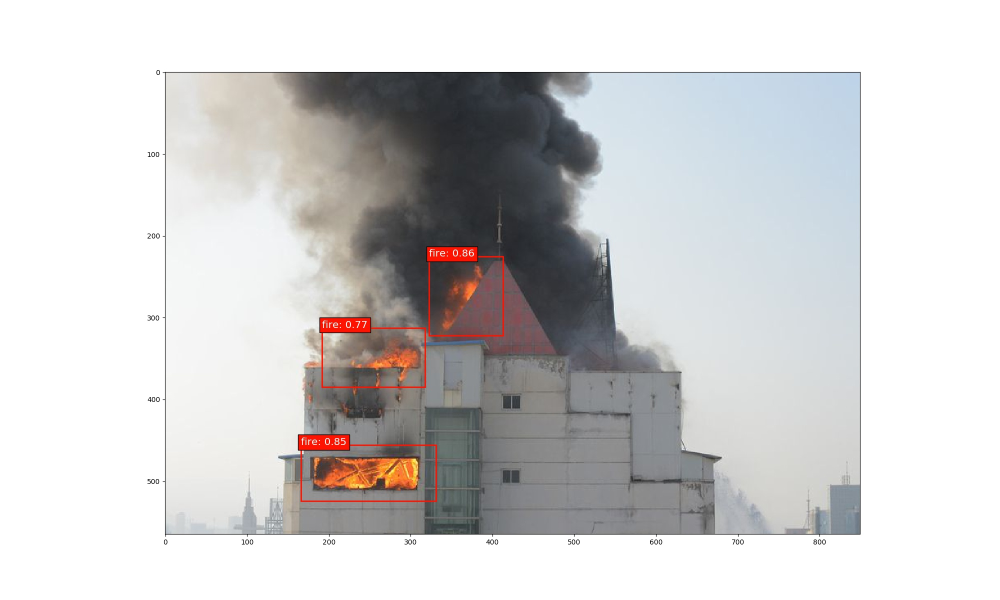
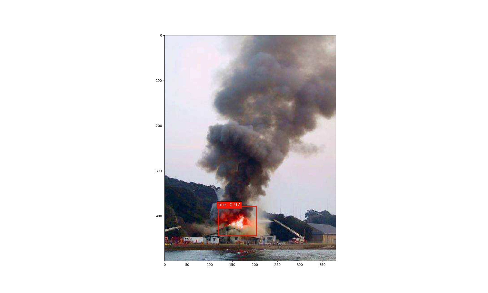
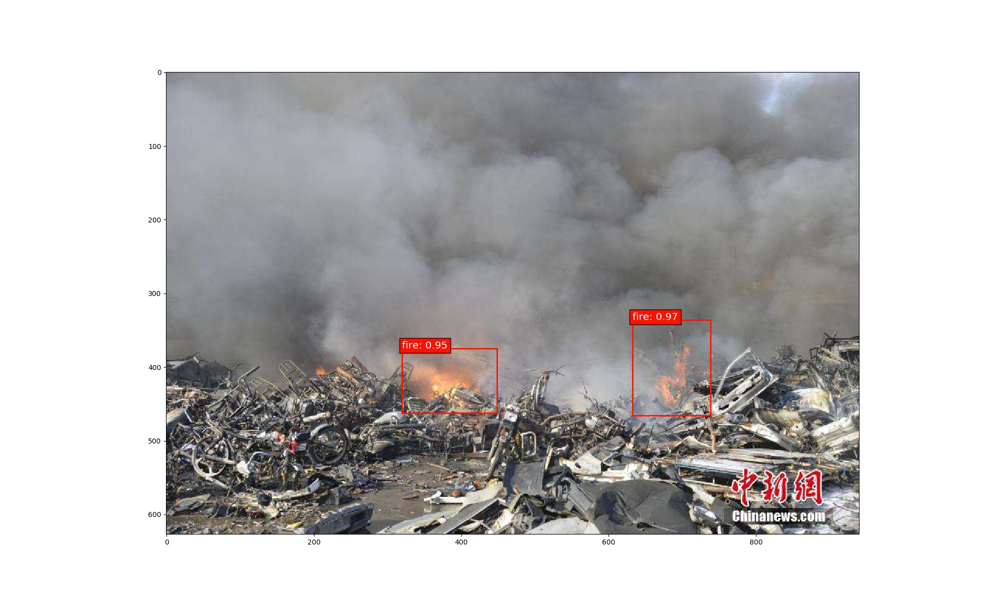
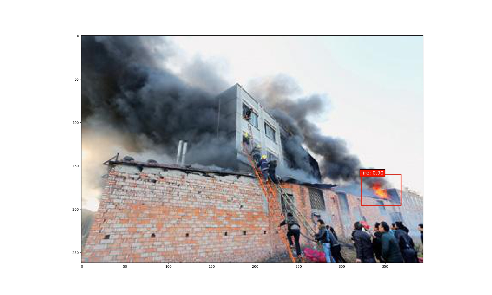

## fire_detect_mobilenet_v2_ssdlite_keras
A keras version of real-time object detection network to detect fire: mobilenet_v2_ssdlite
## the mobilenet_v2_ssdlite_keras project is forked from [markshih91](https://github.com/markshih91/mobilenet_v2_ssdlite_keras).

## Installation
1).Clone this repository.
2).Please refer to the file("requirements.txt") for installation dependency package.

## Test
'''
python experiments/inference_fire.py
'''

## Train
'''
python experiments/train_fire_data.py
'''
## Datasets
please use labelImg tool to making data in VOC format.
And use the following command to generate the imgsets data.
'''
python utils/generate_imagesets.py
'''

## Result
.
.
.
.
.